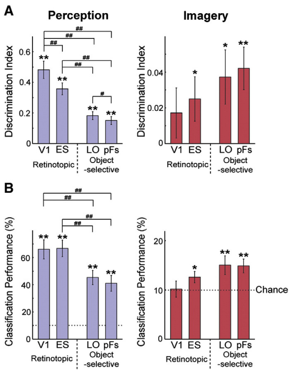
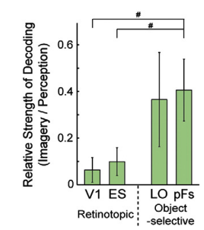

# Disentangling visual imagery and perception of real-world objects

* Date : 2011
* Keywords : *object recognition, perception, visual imagery*

### Background
* **Seen objects** and **Imagined objects**
  * Similarity 
    * The global pattern of brain activation in both imagery and perception is very similar
    * Research suggesting overlap in representation evoked during imagery and perception
  * Difference
    * Brain-damaged patients indicates that imagery and perception can be dissociated
  * So what differentiates the utilization of the tissue by the two processes (**Perception** and **Imagery**) along the ventral visual pathway?

### Methods
* Pre-scan training : Participants were familiarized with the ten object images and practiced generating vivid mental images

* fMRI Experiment
  * 

* Localizer design
    * Object-selective regions : LO(lateral occipital), pFs(posterior fusiform)
    * Retinotopic : V1, ES(extrastriate cortex: V3, V4, V5/MT)

### Results
* Response magnitude
  * Perception : strong responses in all ROIs.
  * Imagery : (1) Much smaller average response + Only ES showed significantly greater than zero / (2) Opposite pattern of response in object-selective compared to perception (retinotopic < object-selective)
  * 

* **Decoding**
* 
1. Perceptual decoding
     * **discrimination index** = (average of Between-image correlations) - (Within-image correlations)
    * EX) Between-image : chair-clock / Within-image : clock-clock
    * Discrimination indices were significantly large in all ROIs, but not equal. 
      * indicates  retinotopic regions evidenced better
perceptual decoding than object-selective regions, and that the posterior was better than the anterior regions for both retinotopic and
object-selective cortex.
    * Multi-class classification ananlysis with SVM : performance in V1 > LO, pFs & performance in ES > LO, pFs
    * Indicates **(1)** Early visual cortex(V1, ES) and Object-selective cortex(LO, pFs) both contains information of seen objects ($\because$ discrimination indices > 0 in all ROIs) / **(2)** Early visual cortex contains more <ins>distinct representation</ins> of percieved object
  
2. Imagery decoding
    * The result indicates information for imagery objects is contained outside of V1 area 
    * $\because$ low discrimination indices in V1 + classification performance in SVM for V1

* Differences in perception and imagery
  * 
  * Indicates the relative roles of retinotopic cortex and object-selective cortex are reversed in perception and imagery
    * $\because$  discrimination during imagery is roughly 40% of discrimination during perception in object-selective regions, it is only 10% of discrimination during perception in retinotopic regions
  
* Decoding between imagery and perception
  * Multidimensional Scaling(MDS) between imagery and perception representations
  * 
  * **(1)** General alignment between imagery(red) and perception(blue) 
  * **(2)** Changes in the overall seperation both within and between the perception and imagery conditions (pFs: well intermixed / V1: imagery conditions closer to the center) 
    * Indicates  that there is greater similarity between perception and imagery in the anterior object-selective regions, particularly pFs
  * 
  * Significant correlation in LO and pFs, but not in V1 and ES (the far-right of the figure)
    * indicates imagery and perception shows similar pattern in **higher areas(LO, pFs)** than **lower areas(V1, ES)**
  * 
  * the overall structure of representations between ROIs is much more similar during imagery than during perception.

* Correlation with behaviour
  * Is correspondance between imagery and perception correlated with VVIQ(standardized battery of visualization questions) ?
  * 
  * both correlated with behavioral measure of vividness, but only significant in early visual cortex

### Discussion

* There is specific pattern of neural activation throughout visual areas for single objects during both visual imagery and perception, and that these patterns are related

* Typical visual processing : (1) bottom-up info about the percieved object / (2) top-down modulatory feedback / (3) integration of bottom-up and top-down signal, which makes an unique representation
  * However in visual imagery, there is no bottom-up signal
    * Which leads to... (1) Reduced complexity of the internal processing / (2) less transformation of the signal between regions
    * Which leads to... (1) Less unique representations (2) Increased correlation in the representation between regions

* Increased correlation between regions during imagery provides evidence of <ins>differential processing in imagery and perception within the same neural substrate</ins>, suggesting that lesions of the same area could selectively impair either.

* (1) Significant decoding in ES for imagery + (2) Cross-decoding between imagery and perception in both V1 and ES
  * Support the theory that visual imagery relies on depictive (picture-like) representations. (Other theory: aurgues that visual imagery relies on symbolic (language-like) representations)

