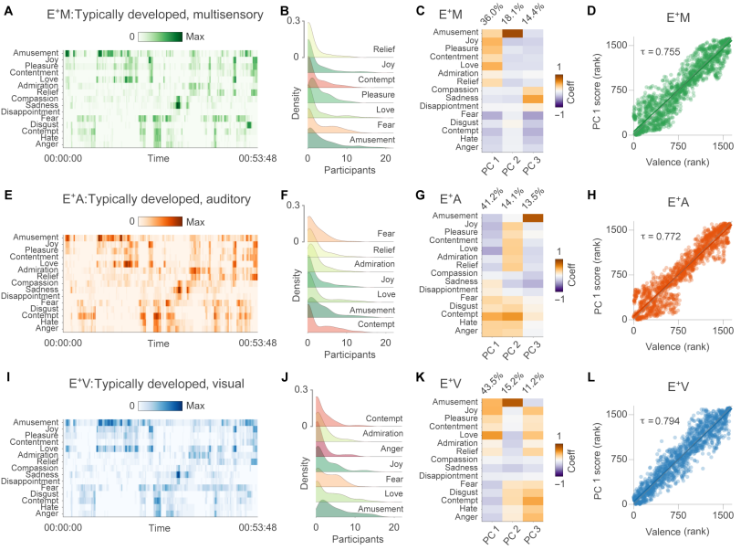
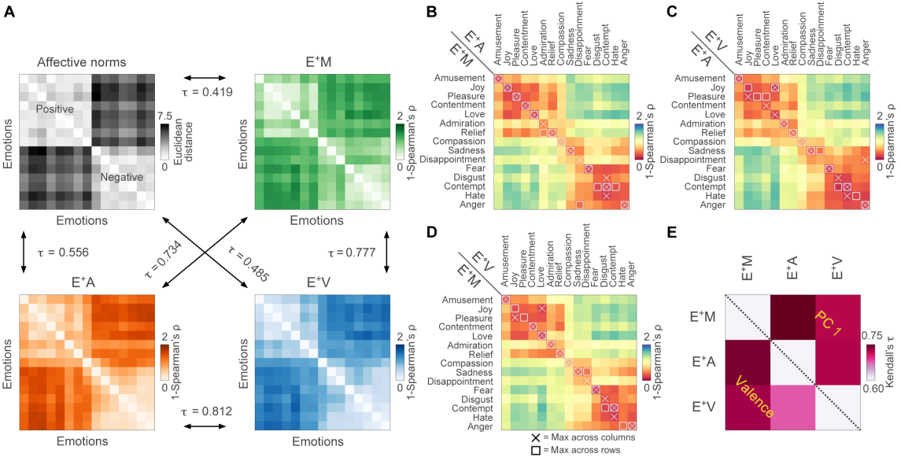
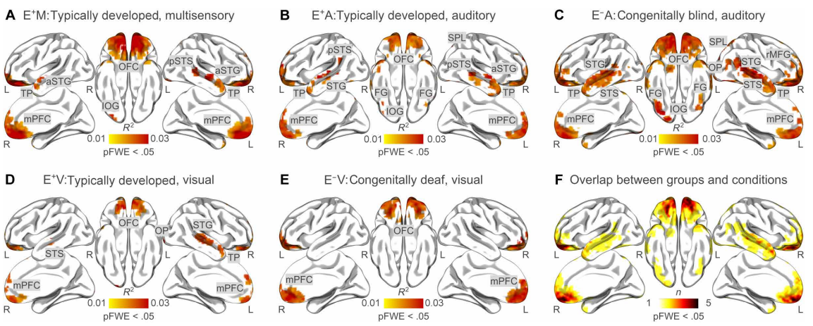

# Dissecting abstract, modality-specific and experience-dependent coding of affect in the human brain

* Date : 2024
* Keywords : *emotion, perception, movie, ventromedial prefrontal cortex(vmPFC), posterior superior temporal cortex*

### Background

* Theories of Emotion
  * Basic theories of Emotion
    * Category based : Anger / Disgust / Fear / Happiness / Sadness / Surprise
    * (1) Region-specific / (2) Pattern-specific
  * Dimensional theories of Emotion
    * Even basic emotions can be broken down into smaller fundamental elements combined in different ways & different arouses
    * Valence (pleasant-unpleasant) / Arousal (weak emotion-strong emotion)
  * Psychological constructionist thoeries of emotion
    * share the same view with dimensional theory (Emotion can be broken down in to smaller parts)
    * but different : Emotion is constructed from physiological processes (language, attention, internal sensations)

* Existing studies : focused on unimodal emotional stimuli with developed individuals
  * problem : for developed individual...fearful scream is likely to give rise of mental imagery (body postures, facial expression etc)
  * Congenital sensory deprivation constitutes a unique model to dissect the differential contribution of specific sensory modalities to the brain representation of the external world accounting for mental imagery

### Methods

* The participants watched a one-hour version of "101 Dalmatians (1996)" and gave real-time emotion
  * The reason for choosing "101 Dalmatians" as an emotional stimuli:
    * Easy plot to understand & have been aired through radio
    * Contains both positive and negative emotional plot
  
* The participants were grouped as, (1) Congenitally blind ($E^-A$) (2) Congenitally deaf ($E^-V$) (3) Developed ($E^+A$, $E^+V$, $E^+M$)
  * ex) $E^-A$ : only auditory with blind group / $E^-V$ : only visual with deaf group / $E^+M$ : multimodal with developed group

* The experiment is consisted of two parts: 
    1) Behavorial experiments : Verify whether real-time valence ratings and categorical anootations of emotions are reliable
    2) fMRI experiments : Fit emotion model in to brain activity
   

### Results

* **Behavorial experiment**
  * **A** : Darker colors indicate that a higher proportion of volunteers have reported the same emotion at a given point in time 
  

* Participants reported similar emotions in similar timepoints, $\therefore$ the <ins>method is reliable</ins>

* **fMRI experiment**
  1) Fitting the emotion model in brain activity
    * $E^+M$
      * **Emotion category model** : lateral orbitofrontal cortex(lOFC), vmPFC, mPFC, anterior portion of the bilateral superior temporal gyrus(aSTG)
      * **Affective experience** : central and posterior segments of the right superior temporal gyrus and sulcus (STG/STS), the right superior parietal lobule (SPL), and the right inferior occipital gyrus (IOG)
    * $E^+A$
      * **Emotion category model** : bilaterally in the lOFC, the mPFC, the vmPFC, the STG/STS, the IOG, the SPL, the fusiform gyrus (FG), and in the left supramarginal gyrus 
      * **Affective expereince** : 

### Discussion
