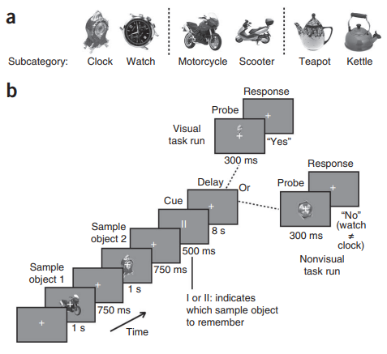
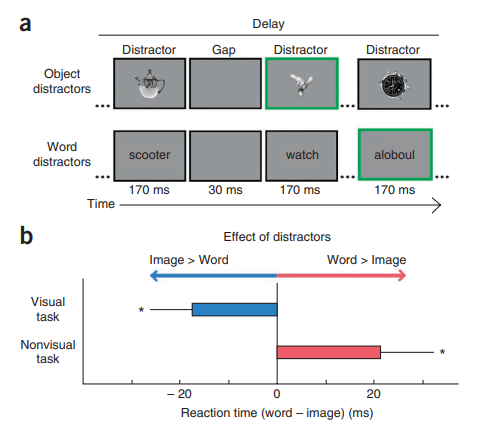
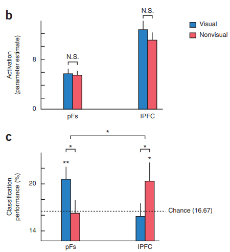

# Goal-dependent dissociation of visual and prefrontal cortices during working memory

* **Date** : 2013
* **Keywords** : *Working Memory, lateral Prefrontal Cortex(lPFC), posterior fusiform cortex(pFs)*

### Background
* The role of individual regions during working memory has long been debated.
    * Early Proposals : **lPFC(lateral Prefrontal Cortex)** controls & maintains working memory
    * Recent studies : **lPFC** initiates & controls working memory / **Posterior cortices** maintains it
    * But there is also evidence that **lPFC** plays a role in maintaining nonvisual content
  
* **lPFC** is commonly activated in working memory + **pFs** is thought to be involved in high-level processing and memory for visual objects
  
* The goal of the present study : Show that the functional role of regions within the working memory network is...
  1. **Flexible**
  2. **Dependent on the nature of maintained information**

### Method

*Participants were informed which task they will perform before the run*
* **Visual task** : participants have to indicate whether the probe image is from the sample object
* **Nonvisual task** : participants have to indicate whether the object in the probe image is from the same subcategory with the sample object

* To verify whether the information maintaned during the delay period is consistent with the given task, additional experiment was performed
* It shows in **visual task**, image distractors was more effective than non-image(word) distractors. In **nonvisual task**, it shows the opposite tendency.

### Result

* **pFs** and **lPFC** were both activated but did not showed difference during delay period *(Fig. b)*
* <ins>Task dependent functional dissociation</ins> between prefrontal and posterior cortices *(Fig. c)*
  * **pFs** : Stronger decoding of maintenance of **visual** than nonvisual properties
  * **lPFC** : Stronger decoding of maintenance of **nonvisual** than visual properties

### Discussion
* The ability to maintain information is a general
property of cortex, flexibly engaged depending on the behavioral
goals