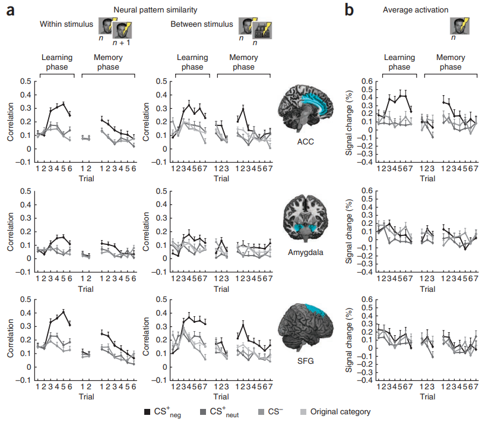

# Neural pattern similarity predicts long-term fear memory

* Date : 2012
* Keywords : *long-term fear memory, ACC(anterior cingulate cortex), insula, amygdala, hippocampus, vmPFC(ventromedial prefrontal cortex), SFG(superior frontal gyrus)*

### Background
* Although the expression of fear during learning is certainly related to long-term memory, much of what we learn does not eventually transform into long-term memory
* 

### Methods

* 6 stimuli, 2 types of category(Faces, Houses)

* ROI selection
    * ACC(anterior cingulate cortex), insula, amygdala, hippocampus and vmPFC
    * SFG(superior frontal gyrus) (to illustrate that robust learningdependent changes, as revealed by similarity analysis, can also be observed outside the salience network)

### Results

### Discussion

* The refinement of an individual stimulus representation (within stimulus) seems to be different from the formation of a higher order fear association (between stimulus)

* Although these two types of neural pattern similarity both reflect fear and extinction learning, they apparently contain different information about future consolidation processes, given that only between-stimulus neural pattern similarity predicts the later behavioral expression of fear memory