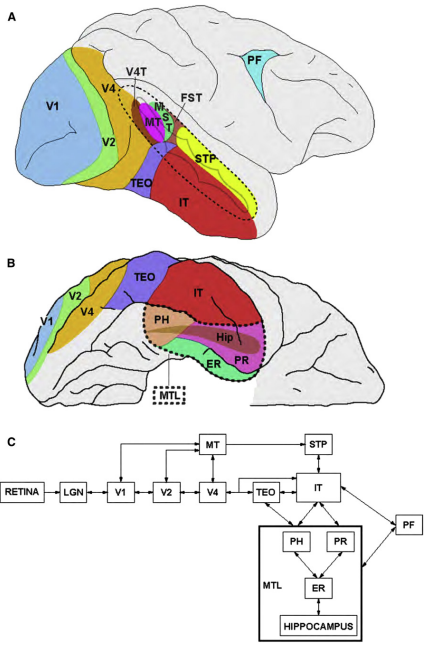
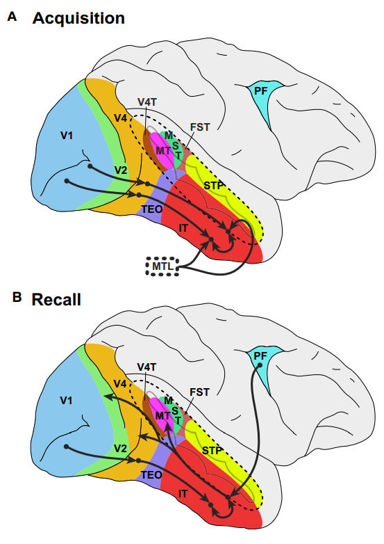

# On the Perception of Probable Things: Neural Substrates of Associative Memory, Imagery, and Perception

* Date : 2012
* Keywords : *A, B, C*

### Background
* Prior knowledge of the world is believed to be manifested as ‘top-down’ neuronal signals that influence the processing of ‘bottom-up’ sensory information arising from the retina.

* This paper is going to review...
  1) Neuronal changes that parallel the acquisition of long-term memories of associations between visual stimuli, such as between a knife and fork or a train and its track. 
  2) Neuronal events that correspond to memories recalled via such learned associations and the relationship of this recall to the phenomenon of visual imagery. 

### Main
* **Visual Associative Learning and Memory**
    * a
    * 
* A Neuronal Foundation for Associative Learning
    * Hypothesis by William James (1890): the behavioral learning of an association between two stimuli is accomplished by the establishment or strengthening of a functional connection between the neuronal representations of the associated stimuli.
    * The predicted neuronal signature of associative learning in visual cortex is a convergence of response magnitudes—as A and B become associated, neurons initially responding selectively to one or the other of these stimuli will generalize to the associated stimulus. 
* Neural Correlates of Visual Associative Learning
  * d
  * The emergence of pair-coding responses in IT cortex supports the conclusion that learning strengthens connectivity between the relevant neuronal representations.

  * 

* Mechanisms of Associative Neuronal Plasticity in IT Cortex

* Is Associative Neuronal Plasticity Unique to IT Cortex?

* MT Neurons Exhibit Associative Plasticity

* What Is Represented by Learning-Dependent Neuronal Selectivity in Area MT?

* Visual Associative Recall

* A Common Neuronal Substrate for Visual Imagery and Perception

* What Is the Source of Recall-Related Signals in Visual
Cortex?
    * 

* What Is the Function of Visual Imagery?

* Explicit Visual Imagery

* Implicit Visual Imagery

* A Neuronal Representation of Probable Things

* Distinguishing Stimulus from Imagery

* Intermodal Associations and Perceptual Experience

* Imagery, Categorical Perception, and Perceptual Learning