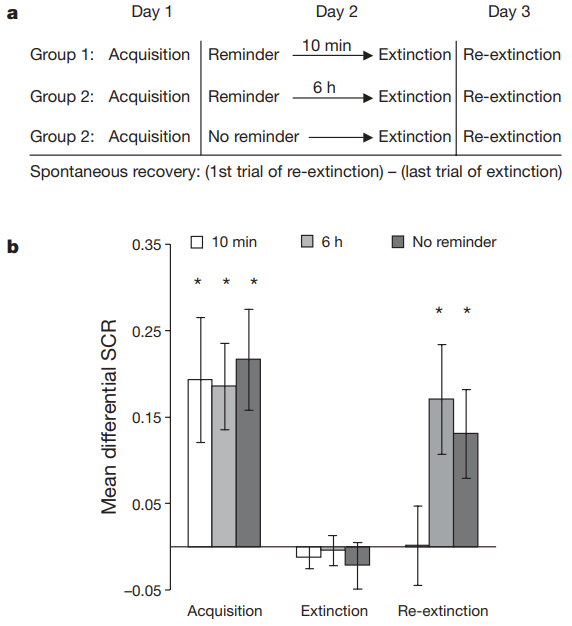

# Preventing the return of fear in humans using reconsolidation update mechanisms

* Date : 2010
* Keywords : *fear, reconsolidation, non-invasive treatment*

### Background

* reconsolidation hypothesis 
  * Suggests that memories are consolidated each time they are retrieved
  *  From an evolutionary perspective, reconsolidation may serve as an adaptive update mechanism allowing for new information, available at the time of retrieval, to be integrated into the initial memory representation

* Research in non-human animals has detailed the molecular processes involved in emotional memory reconsolidation by using protein synthesis inhibitors, or other pharmacological agents 
  * Blocks various stages of this process, after which the memory was no longer expressed -> <ins>not safe</ins> for use in humans

* Updating a fear memory with non-fearful information, provided through extinction training, would rewrite the original fear response and prevent the return of fear

### Methods & Results

**1. First experiment**
* Method
  * Three groups of subjects
  * Two colored squares
    * **CS+** : One square paired with electric shock in 38% of the trials
    * **CS-** : Not paired with electric shock
  * Day 2 : three different groups with different condition of reminder (time / absence)
  * Day 3 (Extinction + 24h) : all three groups were presented again with the conditioned stimuli without the unconditioned stimulus (re-extinction) to assess spontaneous fear recovery
  * Measured with SCR (Skin Conductance Response)
    * Differential fear response = (response of CS+) - (response of CS-)

### Discussion